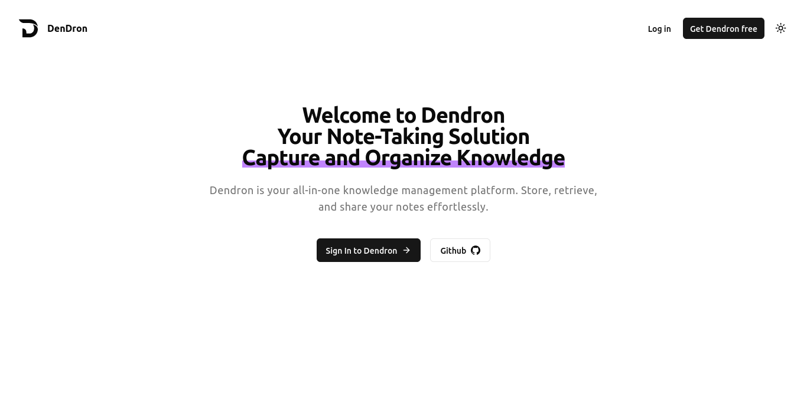

# Dendron

Dendron is a note taking web application built with Next.js 13. It allows users to create, edit, organize and search notes.

> This project is actively under development. If you come across any unclear aspects or have suggestions, please don't hesitate to contact me or create a GitHub issue. We welcome your feedback as we make daily updates to the project.

## preview



## Features

- 📝 rich text editor
- 🗂️ Notebooks for grouping notes
- 🔍 Fast full-text search
- 📷 File uploading
- 🏷️ Tags for quick filtering
- ↔️ Sync and access notes on all devices
- 🗑️ Soft delete and restore deleted notes
- 🌐 Publish notes as public pages
- 🌓 Light and dark mode

## Tech Stack

- [Next.js](https://nextjs.org/): A React framework for building web apps and sites using server-side rendering and static site generation. Provides performance, SEO benefits, and developer experience.

- [React](https://reactjs.org/): A JavaScript library for building user interfaces. Used as the front-end framework.

- [Tailwind CSS](https://tailwindcss.com/): A utility-first CSS framework for rapidly building custom user interfaces.

- [Shadcn UI](https://ui.shadcn.com/): A UI library built using Tailwind CSS and Radix UI that provides a collection of copy-paste components for creating a consistent and stylish user interface.

- [Clerk](https://clerk.dev/): User management and authentication for web applications. Handles user profiles, sign in, access control, and more.

- [Convex](https://convex.dev/): Backend framework for building scalable web apps with React. Provides realtime APIs, database, and business logic.

- [Zod](https://zod.dev/): A TypeScript-first schema validation and object serialization library.

- [Vercel](https://vercel.com/): Deployment and hosting platform for static and serverless sites. Provides optimised performance and developer workflow.

## Getting Started

### Prerequisites

- Node.js and npm

### Installation

1. Clone the repo

```bash
git clone https://github.com/mohamed-lifa7/dendron.git
```

2. Install dependencies

```bash
npm install
```

3. Create a `.env` file with your credentials

4. Run the dev server

```bash
npm run dev
```

5. Open http://localhost:3000 to view the app

## Prerequisites

Before you begin, make sure you have the [Node.js version 18._._](https://nodejs.org/) installed on your machine.

## Contributing

Pull requests are welcome! Feel free to open an issue or submit a PR for any bugs or improvements.

### Reporting Issues

If you encounter a bug, have a feature request, or want to suggest improvements, please open an issue on our [GitHub issue tracker](https://github.com/mohamed-lifa7/dendron.git/issues). When submitting an issue, please provide as much detail as possible, including steps to reproduce the problem if applicable.

### Proposing Changes

If you'd like to contribute code to our project, please follow these steps:

1. Fork the repository to your own GitHub account.
2. Clone your forked repository to your local machine.

```bash
git clone https://github.com/mohamed-lifa7/dendron.git
```

3. Create a new branch for your feature or bug fix.

```bash
git checkout -b feature-name
```

4. Make your changes and commit them with descriptive commit messages.
5. Push your changes to your GitHub repository.

```bash
git push origin feature-name
```

6. Open a pull request (PR) to the main repository's main branch. Provide a clear title and description for your PR.
7. Your PR will be reviewed, and any necessary feedback or changes will be discussed. Once your PR is approved, it will be merged into the main project.

### Code Style

To maintain code consistency, we use ESLint for JavaScript/TypeScript linting. Please make sure your code adheres to our coding standards. You can run ESLint using the following command:

```bash
npm run lint
```

### Contact

If you have any questions or need further assistance, you can reach out to us through the contact section within the app or by creating an issue on GitHub.

Thank you for contributing to Next Drive! We appreciate your support and look forward to your contributions.

## License

This project is licensed under MIT. See [LICENSE](LICENSE) for more details.
